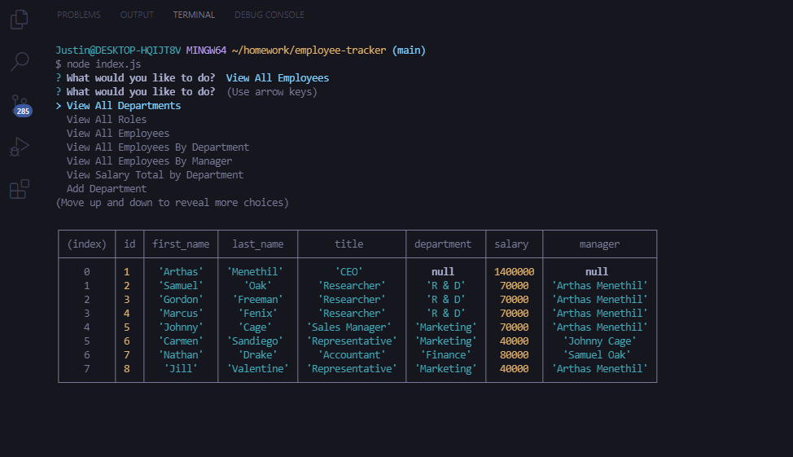
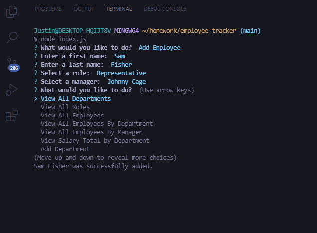

# CLI Employee Management Tool

## Overview
In this following exercise, the user sets up an SQL database and creates a CLI to manage the database. Functionalties include viewing all employees by various parameters and adding/removing/updating roles, departments, and employees.

## Pseudocode
1. Create an SQL database, as well as seed data.
2. Create a prompt that takes in user input.
3. Allow the user the option to view, add, remove, and update employees, roles, departments, etc...
4. Create SQL statements for specific scenarios.
5. Retrieve respective SQL data and convert them into usable objects.

## Installation
1. ```npm i```

## Usage
- ```node index.js``` to run the app.

## Resources
- [Inquirer](https://www.npmjs.com/package/inquirer)
- [SQL](https://www.w3schools.com/sql/)
- [Async-await](https://www.digitalocean.com/community/tutorials/js-async-functions)

## Links
- [Repository](https://github.com/huirayj/employee-tracker)
- [Higher Quality Demo](https://drive.google.com/file/d/1hUzpp3MVZ_DAfDwIGXAH3mnNoOVGFoGr/view?usp=sharing)

## Demo


## Screenshots
### Viewing All Employees

### Adding Employee

